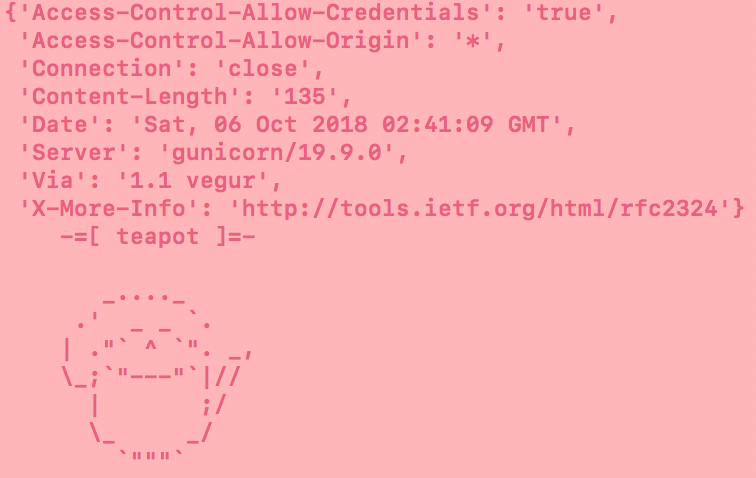
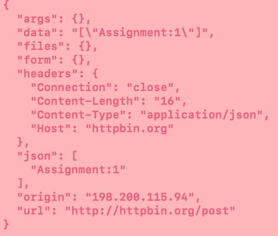

# httpc
To run this command line tool, make sure Python 3.x is installed and execute these commands:
$ source v2/bin/activate
$ pip install --editable .

Some sample commands to execute:
- httpc get -v http://httpbin.org/status/418

- httpc post -h Content-Type:application/json  --d "Assignment":1 http://httpbin.org/post

